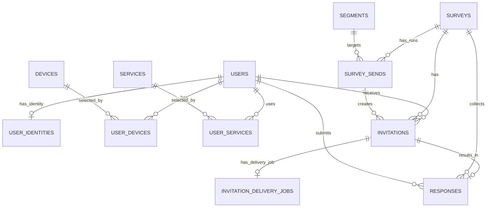

# SurveyGate — ERD & Database Constraints

Документ описывает актуальную модель данных SurveyGate MVP.

SurveyGate — backend-MVP сервиса для рекрутинга UX-респондентов и рассылки опросов по сегментам.

Основной flow:

1. Пользователь регистрируется через bot-like API.
2. Пользователь заполняет профиль: город, возраст, наличие детей, устройства, сервисы.
3. Оператор создаёт survey.
4. Оператор создаёт JSON-сегмент.
5. Система валидирует сегмент и компилирует его в SQLAlchemy-запрос.
6. Оператор запускает рассылку survey по segment.
7. Система создаёт `SurveySend`.
8. Система выбирает подходящих пользователей.
9. Для каждого пользователя создаётся `Invitation`.
10. Для каждого invitation создаётся `InvitationDeliveryJob`.
11. Delivery job ставится в Redis/RQ queue.
12. Worker обрабатывает delivery job и обновляет статус доставки.
13. Пользователь открывает публичную ссылку `/s/{survey_id}/{token}`.
14. При отправке ответа создаётся `Response`, а invitation помечается как completed.

---

## Current MVP Scope

В текущий MVP входят:

- users/respondents;
- Telegram identity;
- devices/services;
- user profile;
- surveys;
- JSONB segments;
- survey sends;
- invitations;
- hashed invitation tokens;
- public invite open/submit flow;
- responses;
- invitation delivery jobs;
- Redis/RQ delivery queue;
- stub delivery вместо реального Telegram API.

В текущий MVP не входят:

- promo codes;
- production-ready auth/authz;
- реальная интеграция с Telegram Bot API;
- полноценная `/delete_me` policy;
- retry/backoff/dead-letter queue;
- outbox/sweeper для восстановления delivery jobs.

---

## High-level ERD



---

## Tables

### `users`

Хранит основную информацию о респонденте.

Основные поля:

- `id`
- `city`
- `age`
- `has_children`
- `is_deleted`
- `deleted_at`
- `created_at`
- `updated_at`

Используется для сегментации пользователей.

---

### `user_identities`

Хранит внешнюю идентичность пользователя.

Основные поля:

- `user_id`
- `telegram_id`
- `created_at`
- `deleted_at`

Constraints:

- `user_id` — primary key;
- `telegram_id` — unique.

В текущем MVP Telegram ID используется как основной внешний идентификатор пользователя.

---

### `devices`

Справочник устройств.

Основные поля:

- `id`
- `code`
- `title`

Constraints:

- `code` — unique.

---

### `services`

Справочник сервисов.

Основные поля:

- `id`
- `code`
- `title`

Constraints:

- `code` — unique.

---

### `user_devices`

Many-to-many связь пользователей и устройств.

Основные поля:

- `user_id`
- `device_id`

Constraints:

- primary key: `(user_id, device_id)`.

---

### `user_services`

Many-to-many связь пользователей и сервисов.

Основные поля:

- `user_id`
- `service_id`

Constraints:

- primary key: `(user_id, service_id)`.

---

### `surveys`

Хранит опросы.

Основные поля:

- `id`
- `title`
- `status`
- `starts_at`
- `ends_at`
- `created_at`

Статусы:

```text
draft | active | closed
```

Constraints:

```sql
CHECK (status IN ('draft', 'active', 'closed'))
```

---

### `segments`

Хранит JSONB-сегменты пользователей.

Основные поля:

- `id`
- `name`
- `filters`
- `created_at`

`filters` содержит JSON DSL, который валидируется и компилируется в SQLAlchemy-запрос.

Сегменты могут использовать поля пользователя и связи:

- `city`;
- `age`;
- `has_children`;
- `devices`;
- `services`.

---

### `survey_sends`

Хранит запуск рассылки survey по segment.

Основные поля:

- `id`
- `survey_id`
- `segment_id`
- `message_template`
- `ttl_days`
- `created_at`

`SurveySend` группирует invitations, созданные одним запуском рассылки.

---

### `invitations`

Хранит бизнес-приглашения пользователей на survey.

Основные поля:

- `id`
- `survey_id`
- `user_id`
- `send_id`
- `token_hash`
- `status`
- `created_at`
- `sent_at`
- `expires_at`
- `used_at`
- `revoked_at`
- `resend_count`

`Invitation` — это бизнес-сущность: факт того, что пользователь приглашён пройти survey.

Raw token не хранится в базе.  
В базе хранится только `token_hash`.

Constraints:

```sql
UNIQUE (token_hash)
```

```sql
UNIQUE (survey_id, user_id)
WHERE revoked_at IS NULL AND used_at IS NULL
```

Partial unique index означает:

> У пользователя не может быть двух активных invitation на один survey.

Активным считается invitation, который ещё не использован и не отозван.

---

### `invitation_delivery_jobs`

Хранит техническую задачу доставки invitation.

Основные поля:

- `id`
- `invitation_id`
- `telegram_id`
- `message_text`
- `status`
- `attempts`
- `last_error`
- `created_at`
- `queued_at`
- `sent_at`

`InvitationDeliveryJob` отделён от `Invitation`, чтобы не смешивать бизнес-логику приглашения и технический процесс доставки.

Статусы:

```text
pending | queued | processing | sent | failed
```

Constraints:

```sql
UNIQUE (invitation_id)
```

В текущем MVP один invitation имеет один delivery job.

---

### `responses`

Хранит ответы пользователей.

Основные поля:

- `id`
- `survey_id`
- `user_id`
- `invitation_id`
- `answers`
- `submitted_at`

Constraints:

```sql
UNIQUE (invitation_id)
```

Это гарантирует, что один invitation может породить только один response.

Если бизнес-правило должно запрещать пользователю отвечать на один survey больше одного раза, можно дополнительно добавить:

```sql
UNIQUE (survey_id, user_id)
```

---

## Core Invariants

### 1. Raw token is not stored

При создании invitation система генерирует raw token, но в базе сохраняет только `token_hash`.

Публичная ссылка имеет вид:

```text
/s/{survey_id}/{token}
```

При открытии ссылки система хэширует token из URL и ищет invitation по hash.

---

### 2. One active invitation per user and survey

В базе действует partial unique index:

```sql
UNIQUE (survey_id, user_id)
WHERE revoked_at IS NULL AND used_at IS NULL
```

Это защищает от ситуации, когда у одного пользователя одновременно есть два активных invitation на один survey.

---

### 3. Completion = response + used invitation

При submit:

1. создаётся `Response`;
2. у invitation проставляется `used_at`;
3. invitation получает статус `completed`.

`responses.invitation_id UNIQUE` защищает от повторной отправки ответа по одному invitation.

---

### 4. Invitation and delivery job are separated

`Invitation` отвечает за бизнес-факт приглашения.

`InvitationDeliveryJob` отвечает за техническую доставку сообщения.

Это позволяет отдельно хранить:

- статус приглашения;
- статус доставки;
- количество попыток;
- ошибку доставки;
- timestamps доставки.

---

### 5. PostgreSQL is the source of truth

Redis/RQ используется только как очередь выполнения.

PostgreSQL хранит persistent state:

- invitations;
- delivery jobs;
- responses;
- delivery status;
- attempts;
- errors.

Redis не является источником истины.

---

## Queue / Worker Flow

Delivery queue:

```text
invitation_delivery
```

Flow:

```text
InvitationDeliveryJob.pending
  -> queued
  -> processing
  -> sent
```

При ошибке:

```text
processing -> failed
```

Успешная доставка обновляет:

- `invitation_delivery_jobs.status = 'sent'`;
- `invitation_delivery_jobs.sent_at`;
- `invitations.status = 'sent'`;
- `invitations.sent_at`.

---

## Public Invite Flow

### Open invite

Endpoint:

```text
GET /s/{survey_id}/{token}
```

Логика:

1. Хэшировать token.
2. Найти invitation.
3. Проверить, что invitation:
   - существует;
   - не revoked;
   - не used;
   - не expired.
4. Если status = `sent`, обновить на `opened`.

---

### Submit response

Endpoint:

```text
POST /s/{survey_id}/{token}
```

Логика:

1. Хэшировать token.
2. Найти invitation.
3. Проверить, что invitation:
   - существует;
   - не revoked;
   - не used;
   - не expired.
4. Создать `Response`.
5. Сохранить `answers`.
6. Проставить `used_at`.
7. Обновить status на `completed`.

---

## Important Notes

### Promo codes

Промокоды не входят в текущую модель данных MVP.

Таблицы вроде:

- `promo_code_pool`;
- `promo_issuances`

не должны быть частью актуального ERD-документа, пока они не реализованы.

---

### Invitation status

В текущей модели `invitation.status` хранится как string.

Рекомендуется добавить DB-level constraint:

```sql
CHECK (status IN ('queued', 'sent', 'opened', 'completed', 'revoked'))
```

`expired` лучше считать вычисляемым состоянием через `expires_at`, а не хранить как отдельный persisted status.

---

### Survey answers schema

В текущей модели `responses.answers` хранится как JSONB без DB-level schema validation.

Если в будущем нужна строгая структура ответов, можно добавить:

```text
surveys.public_schema jsonb
```

и валидировать ответы перед сохранением.

---

## Future Improvements

Перед production стоит добавить:

- real Telegram API;
- retry/backoff;
- dead-letter queue;
- outbox/sweeper для delivery jobs;
- нормальную operator auth model;
- audit log;
- rate limiting;
- idempotent submit;
- transaction locking на submit;
- полноценную `/delete_me` / anonymization policy;
- retention policy для delivery jobs;
- DB constraint для `invitations.status`;
- возможно, `UNIQUE (responses.survey_id, responses.user_id)`.